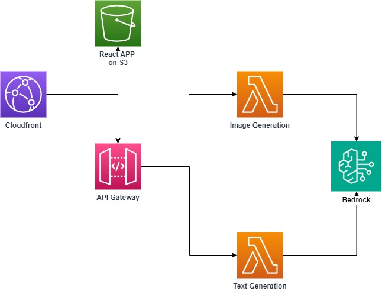
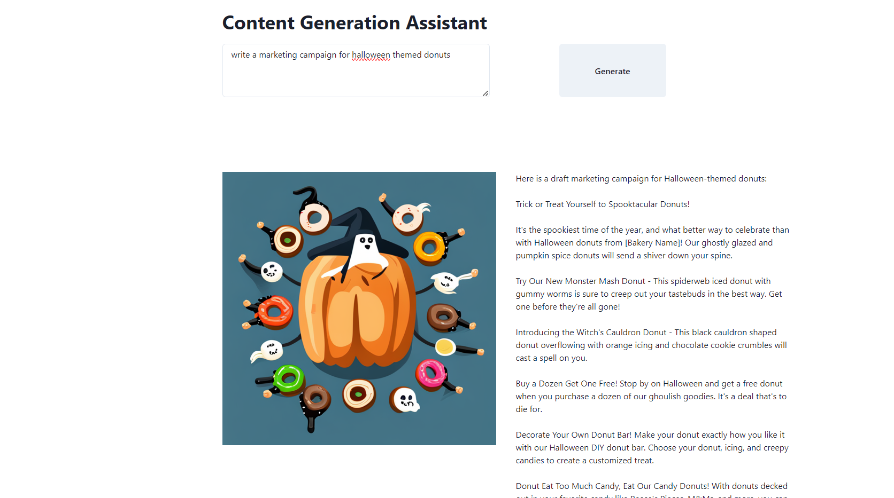

# Welcome to your CDK TypeScript project

This demonstrates a simple web-app leveraging the capabilities for Bedrock. It takes a text box for input and generates both text/image using models within Bedrock. The entire stack is deployed using AWS CDK. 

## Architecture

## Pre-requisites
* Enable Bedrock access and access to the models specifically Claude V2 and Stable Diffusion XL

## Useful commands

* `cd web-app && npm run build` builds the web app 
* `cdk synth`       emits the synthesized CloudFormation template
* `cdk diff`        compare deployed stack with current state
* `cdk deploy`      deploy this stack to your default AWS account/region

## Usage
* Write an email to introduce new pair of running shoes
* write a marketing campaign for halloween themed donuts

## Example

